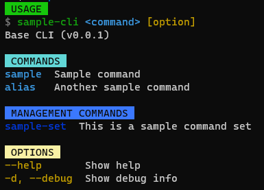

# create-base-cli 

This project allows you to generate a custom Command-Line Interface (CLI) from a template. With just one command, you can create a ready-to-use CLI for your projects.

## Usage

Once you have installed the dependencies, you can use the following command to generate a custom CLI:

```bash
npx create-base-cli my-project
```

Replace `my-project` with your project name and follow the instructions provided. After completing the process, you will have a customized CLI ready to use in your project.

## Key Features

- **Command Customization:** Built with meow, allowing for full customization of flags and command options.

- **Auto-completion:** Enhance user experience with command-line auto-completion.

- **Command Organization:** Organize your commands neatly into sets and individual commands.

- **Easy Configurations:** Store and access CLI configurations conveniently through JSON files in the user's home directory.

- **Update Notifications:** Automatically notify users when a new version of your CLI is available.

- **Is beautiful:** Just see what a beautiful it is \*-\*



## Contributions

If you'd like to contribute to this project, we welcome you! Feel free to open issues or submit pull requests.

## License

This project is distributed under the [MIT](LICENSE). Feel free to modify it as per your project's requirements.
